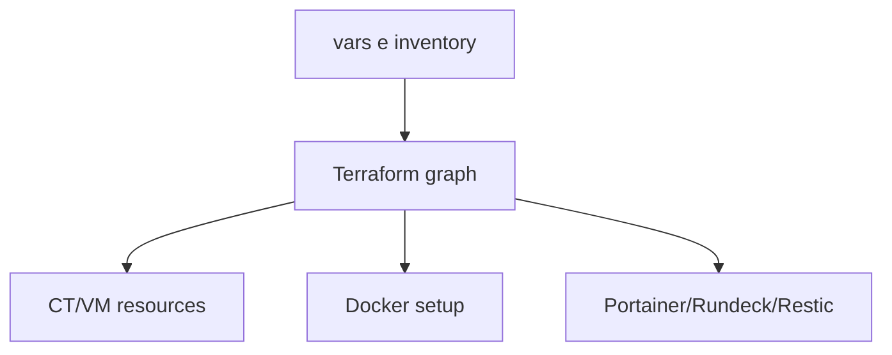

# Terraform Proxmox Platform

Repositorio Terraform para provisao de infraestrutura com Proxmox e componentes de operacao (Docker, Portainer, Rundeck, backup).

> Estado do projeto: ativo.
> Modelo declarativo orientado por ficheiros `*.tf` no root.

---

## Ambiente suportado

Previsto para:

* Terraform CLI
* Proxmox provider
* Linux/macOS para execucao de `terraform`

---

## Requisitos

### Terraform

* `terraform init`
* providers definidos em `providers.tf`

### Variaveis/credenciais

* ficheiros `vars-*.tf`
* credenciais via `*.tfvars`/env vars

---

## Seguranca

* Nao versionar segredos em claro.
* Usar backend/state com controlo de acesso.
* Rever plano (`terraform plan`) antes de `apply`.

---

## Instalacao

### 1) Clonar repositorio

```bash
git clone https://forgejo.lbtec.org/lmbalcao/terraform.git
cd terraform
```

---

### 2) Inicializar

```bash
terraform init
```

---

### 3) Plan/apply

```bash
terraform plan
terraform apply
```

---

## Configuracao

Ficheiros principais:

* `00-inventory.tf`
* `00-validations.tf`
* `01-proxmox_ct_deploy.tf`
* `02-proxmox_vm_deploy.tf`
* `05-post_proxmox_deploy.tf`
* `10-restic_deploy.tf`
* `15-docker_setup.tf`
* `20-docker_deploy.tf`
* `30-portainer_endpoints.tf`
* `50-rundeck_deploy.tf`

---

## Servicos

| Bloco | Funcao |
| ----- | ------ |
| CT deploy | ciclo de vida de containers Proxmox |
| VM deploy | ciclo de vida de VMs Proxmox |
| post-provision | configuracao posterior ao deploy |
| docker setup/deploy | runtime docker e stacks |
| portainer/rundeck | integracao operacional |
| restic | base de backups |

---

## Persistencia

Estado Terraform depende do backend configurado (local/remoto).

Artefactos versionados:

* ficheiros `*.tf`
* lockfile `.terraform.lock.hcl`

---

## Arquitetura



---

## Troubleshooting

### Provider/autenticacao falha

Validar credenciais e `providers.tf`.

### Plano inesperado

Rever diff do `terraform plan` e input vars antes de aplicar.

---

## Notas

* Repositorio orientado a IaC declarativa no root.
* Alguns ficheiros legacy/teste podem coexistir e devem ser revistos antes de producao.
